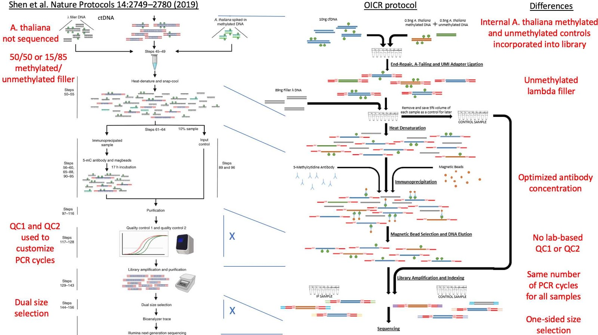

```{r setup, include=FALSE, echo=FALSE}
# load essential libraries
knitr::opts_chunk$set(echo = TRUE)
library(shiny)
library(ggplot2)
library(gtools)
library(reshape2)
```

## GOAL
Assess the level of non-specific binding and correlation of bin counts between published and OICR implemented cfMeDIP-seq protocols, with specific focus on the effect of the methylated lambda DNA mix.

## METHODS
Three experimental conditions run on 5 healthy controls samples. 
\
\



## DATA

#### sample names and protocol definitions

```{r, echo = F}
# head(bin300bp.data.filter1.test)
annotations <- read.csv("data/annotations.txt", sep = "\t", as.is = T)
annotations <- annotations[annotations$RUN.INFO != "EXTERNAL_PUGH_LAB",]
# display on demand
inputPanel(
    checkboxInput("showData", label= "Data table", 
                  value = FALSE, width = NULL)
)
renderTable({
   if (input$showData){
     annotations[,c("Effective.sample.ID","notes", "IDENT")]
   } else {
     unique(annotations[,c("Effective.sample.ID")])
     }
  }) 


```
\
```{r, echo = F}
renderTable({
  if (!input$showData){
  unique(annotations[,c("notes", "IDENT")])
  }
})
```

## AIM 1 -  Assess level of global enrichment achieved by each cfMeDIP-seq protocol 

To assess efficiency of immunoprecipitation, we will compare a series of metrics that capture the fold-enrichment for CpG regions expected to contain methylated DNA. 
\
Falsifiable hypothesis to test: “The cfMeDIP protocols enriched methylated DNA to statistically equivalent levels.”
\

```{r, echo = FALSE}
# insert table of annotations for samples
dashi.metrics <- read.csv("data/dashi_metrics/medips_dashi.txt", sep = "\t", as.is = T)
dashi.metrics <- dashi.metrics[dashi.metrics$RUN.INFO != "EXTERNAL_PUGH_LAB",]
# head(dashi.metrics)
# data for display to be chosen on fly
# Alignment metrics
eval_metrics <- readLines("data/dashi_metrics/metrics_def.txt")
# head(eval_metrics)
converted_eval_metrics <- stringr::str_replace_all(eval_metrics, " ", ".")
# head(converted_eval_metrics)

# design panel
inputPanel(
  # load run names based on project selected
  selectInput("metrics", label = "Metrics for evaluation",
              choices = c("select metric name"), selected = "metric", width = 2000),
  checkboxInput("scaleY", label= "Scale Y axis log10", 
                  value = FALSE, width = NULL),
  checkboxInput("ident", label= "group by IDENT", 
                  value = TRUE, width = NULL),
  checkboxInput("notes", label= "group by notes", 
                  value = TRUE, width = NULL)
  # checkboxInput("addJitter", label= "add jitter to boxplots", 
  #                 value = FALSE, width = NULL)
)

observe({
  updateSelectInput(
    session,
    "metrics",
    choices = eval_metrics
  )
})

metrics_data <- reactive({
  metric.eval <- input$`metrics`
  converted.eval.metrics <- stringr::str_replace_all(metric.eval, " ", ".")
  metric.data <- dashi.metrics[,c("Effective.sample.ID", "notes", "IDENT", converted.eval.metrics)]
  names(metric.data) <- c("Effective.sample.ID", "notes", "IDENT", "metric.eval")
  return (metric.data)
})

```


#### Alignment and MEDIPS metrics

```{r, echo = F}
# ordered plots
# plot this data frame
renderPlot({
  plot.metr <- metrics_data()
  metric <- input$`metrics`
  plot1 <- ggplot(plot.metr) +
    geom_point(aes(x = Effective.sample.ID, y = metric.eval, color = notes, shape = IDENT), size = 4) + 
    ylab(metric) +  xlab("")+
    theme_bw() + theme(axis.text.x = element_text(angle = 90, hjust = 1), axis.title.y = element_text(size = 8)) +
    facet_grid(. ~ IDENT + notes) 
  if (input$`scaleY`){
     plot1 <- plot1 + scale_y_log10()
  }
  plot1
 
}, width = 800, height = 400)
```


```{r, echo = F}
# boxplots NOT needed
# renderPlot({
#   plot.metr <- metrics_data()
#   metric <- input$`metrics`
#   plot.metr$group <- paste(plot.metr$IDENT, plot.metr$notes, sep = "\n")
#   if (!input$`ident`){
#     plot.metr$group <- plot.metr$notes
#   }
#   if (!input$`notes`){
#     plot.metr$group <- plot.metr$IDENT
#   }
#   plot4 <- ggplot(plot.metr) + 
#     geom_boxplot(aes(x = group, y = metric.eval, fill = group)) + 
#     ylab(metric) +  xlab("")+
#     theme_bw() + theme(axis.title.y = element_text(size = 8))
#   if (input$`addJitter`){
#     plot4 <- plot4 + geom_jitter(aes(x = group, y = metric.eval))
#   }
#   plot4
# }, width = 800, height = 400)


```
\
Kruskal-Wallis test to compare medians. Table for p-values.
\
```{r, echo = F}
# table of pvalues and pair wise comparison
renderTable({
  # pairwise 
  plot.metr <- metrics_data()
  metric <- input$`metrics`
  plot.metr$group <- paste(plot.metr$IDENT, plot.metr$notes, sep = "\n")
  if (!input$`ident`){
    plot.metr$group <- plot.metr$notes
  }
  if (!input$`notes`){
    plot.metr$group <- plot.metr$IDENT
  }
  groups <- unique(plot.metr$group)
  # pval.table <- c('group1', 'group2', 'pval')
  kwmatrix <- c('group1', 'group2', 'pval')
  kwmatrix <- matrix(NA, nrow = length(groups), ncol = length(groups))
  row.names(kwmatrix) <- groups
  colnames(kwmatrix) <- groups
  for (grp1 in groups){
    plot.metr.1 <- plot.metr[plot.metr$group == grp1,]
    for (grp2 in groups){
      if (grp1 == grp2){
        next
      }
      plot.metr.2 <- plot.metr[plot.metr$group == grp2,]
      combined_test_data <- data.frame(rbind(plot.metr.1, plot.metr.2))
      # print (combined_test_data)
      # ktest <- kruskal.test(as.numeric(combined_test_data$metric), as.factor(combined_test_data$group))
      ktest <- kruskal.test(metric.eval ~ group, data = combined_test_data)$p.value
      # kwmatrix <- rbind(kwmatrix,c(grp1, grp2, ktest))
      kwmatrix[grp1, grp2] <- ktest
    }
    # break
  }
  # kwmatrix
  # colnames(kwmatrix) <- kwmatrix[1,]
  # kwmatrix <- data.frame(kwmatrix[-1,])
  unique(kwmatrix)
},rownames = T)
```


#### Hoffman spike-in control metrics

Generated using bowtie2 + samtools
\
command used to generate these metrics: 
\

<p style="font-family: courier, courier; font-size:10pt; font-style:bold">
bowtie2 --local \
-x \${bowtieIndex} \
-p 12 \
--minins 80 \
--maxins 320 \
--no-unal \
-q \
-1 $fq1 \
-2 $fq2 \
-S ${output_sam} \
--un-conc-gz \$dir/\$sname.unaligned
\
\
samtools view -bS \${output_sam} > \${outputBam}
\
samtools sort \${outputBam} -o \${sortedBam}
\
samtools index \${sortedBam}
\
</p> 

```{r, echo=F}
spikeins <- read.csv("data/hoffman_spikeins/spikeins2.txt", sep = "\t", as.is = T)
# spikeins <- spikeins[,1:11]
# head(spikeins)

# config for spikeins
config.spikeins <- c(names(spikeins)[2],names(spikeins)[4:7])
# config.spikeins

# design panel
inputPanel(
  # load run names based on project selected
  selectInput("Spike.In.Size", label = "Size of spike-in control",
              choices = c("Spike.In.Size"), selected = "Spike.In", width = 2000),
  checkboxInput("compareSampleWide", label= "Show sample level comparision", 
                  value = TRUE, width = NULL),
  checkboxInput("methControl", label= "show methylated controls", 
                  value = TRUE, width = NULL),
  checkboxInput("unmethControl", label= "show unmethylated controls", 
                  value = TRUE, width = NULL)
)

observe({
  updateSelectInput(
    session,
    "Spike.In.Size",
    choices = spikeins$Spike.In.Size
  )
})


getBetaMeth <- reactive({
  plot.spikes <- getDefinitiveSpikeInData()
  total.spikes <- spikeins[spikeins$Spike.In == "total",]
  row.names(total.spikes) <- paste0(total.spikes$Effective.sample.ID, "_", total.spikes$notes, "_", total.spikes$IDENT)
  spikeins.bysize <- spikeins[spikeins$Spike.In != "total",]
  spikeins.bysize$total <- total.spikes[paste0(spikeins.bysize$Effective.sample.ID, 
                                             "_", spikeins.bysize$notes, 
                                             "_", spikeins.bysize$IDENT), ]$Read.Count
  meth.controls <- spikeins.bysize[spikeins.bysize$Spike.In.Type == "meth",]
  unmeth.controls <- spikeins.bysize[spikeins.bysize$Spike.In.Type == "unmeth",]
  row.names(unmeth.controls) <-   paste0(unmeth.controls$Effective.sample.ID, "_", 
                                       unmeth.controls$notes, "_", 
                                       unmeth.controls$IDENT,
                                       unmeth.controls$Spike.In.Size,"_", 
                                       unmeth.controls$pct_GC, "_",
                                       unmeth.controls$Spike.In.C)

  meth.controls$UNMETH.ReadCounts <- unmeth.controls[paste0(meth.controls$Effective.sample.ID, "_", 
                                               meth.controls$notes, "_", 
                                               meth.controls$IDENT,
                                               meth.controls$Spike.In.Size,
                                               "_", meth.controls$pct_GC, "_",
                                               meth.controls$Spike.In.C),]$Read.Count
  meth.controls$betaMeth <- meth.controls$Read.Count/(meth.controls$Read.Count + meth.controls$UNMETH.ReadCounts)
# head(meth.controls)
  return(meth.controls)
})


getDefinitiveSpikeInData <- reactive({
  # def.spikein <- getBetaMeth()
  def.spikein <- spikeins[spikeins$Spike.In.Size == input$`Spike.In.Size`,]
  def.spikein$group <- paste(def.spikein$IDENT, def.spikein$notes, sep = "\n")
  # total.reads <- def.spikein[def.spikein$Spike.In == "total",]
  # def.spikein$betaMethylation <- 
  if (!input$`ident`){
    def.spikein$group <- def.spikein$notes
  }
  if (!input$`notes`){
    def.spikein$group <- def.spikein$IDENT
  }
  def.spikein$IDENT <- factor(def.spikein$IDENT,
                                   levels=c("UHN", "TGL", "GRP"))
  def.spikein$notes <- factor(def.spikein$notes,
                                levels=c("Control","UNmethylated", "METHylated"))
  def.spikein$Effective.sample.ID <- factor(def.spikein$Effective.sample.ID,
                                levels=c("HCC-002-Control-2-cfDNA",
                                         "HCC-004-Control-2-cfDNA",
                                         "HCC-005-Control-2-cfDNA",
                                         "HCC-017-Control-2-cfDNA",
                                         "HCC-019-Control-2-cfDNA"))
  def.spikein <- def.spikein[with(def.spikein, 
                                      order(Effective.sample.ID,IDENT,notes)),]
  
  return (def.spikein)
})


# plot based on these
renderPlot({
  plot.spikes <- getDefinitiveSpikeInData()
  plot.spikes$Effective.sample.ID <- stringr::str_replace_all(plot.spikes$Effective.sample.ID, "-", "\n")
  # sort C's lexicographically
  plot.spikes$Spike.In.C <- factor(plot.spikes$Spike.In.C, levels=mixedsort(unique(plot.spikes$Spike.In.C)))

  if(input$`compareSampleWide`){
  plt <- ggplot() +
       geom_point(data = plot.spikes,
                  aes(x = Spike.In.C, y = betaMeth), color = "red", size = 4, alpha = 0.5) +
      theme_bw() +
      facet_grid(Effective.sample.ID ~ pct_GC + group, space = "free") +
      theme(axis.text.x = element_text(angle = 90, hjust = 1)) +
    geom_point(data = plot.spikes,
                  aes(x = Spike.In.C, y = betaUnmeth), color = "blue", shape = 2, size = 4, alpha = 0.5) +
      theme_bw() +
      facet_grid(Effective.sample.ID ~ pct_GC + group, space = "free") +
      theme(axis.text.x = element_text(angle = 90, hjust = 1)) + 
    ylab('beta for spike-ins') + ylim(0,1)
    if (!input$`unmethControl`){
      plt <- ggplot() +
       geom_point(data = plot.spikes,
                  aes(x = Spike.In.C, y = betaMeth), color = "red", size = 4, alpha = 0.5) +
      theme_bw() +
      facet_grid(Effective.sample.ID ~ pct_GC + group, space = "free") +
      theme(axis.text.x = element_text(angle = 90, hjust = 1))+ 
    ylab('beta for methylated spike-ins') + ylim(0,1)
    }
    
    if (!input$`methControl`){
      plt <- ggplot() +
       geom_point(data = plot.spikes,
                  aes(x = Spike.In.C, y = betaUnmeth), shape = 2,color = "blue", size = 4, alpha = 0.5) +
      theme_bw() +
      facet_grid(Effective.sample.ID ~ pct_GC + group, space = "free") +
      theme(axis.text.x = element_text(angle = 90, hjust = 1))+ 
    ylab('beta for unmethylated spike-ins') + ylim(0,1)
    }
  } else {
    # for group wise comparision
  plt <- ggplot(data = plot.spikes,
                  aes(x = Spike.In.C, y = betaMeth)) +
       geom_point(color = "red", size = 4, alpha = 0.5) +
      theme_bw() +
      facet_grid(Effective.sample.ID ~ pct_GC + group, space = "free") +
      theme(axis.text.x = element_text(angle = 90, hjust = 1)) +
    geom_point(data = plot.spikes,
                  aes(x = Spike.In.C, y = betaUnmeth), color = "blue", shape = 2, size = 4, alpha = 0.5) +
      theme_bw() +
      facet_grid(. ~ pct_GC + group, space = "free") +
      theme(axis.text.x = element_text(angle = 90, hjust = 1)) + 
    ylab('beta for spike-ins') + ylim(0,1)
  if (!input$`unmethControl`){
      plt <- ggplot(data = plot.spikes,
                  aes(x = Spike.In.C, y = betaMeth)) +
       geom_point(color = "red", size = 4, alpha = 0.5) +
      theme_bw() +
      facet_grid(. ~ pct_GC + group, space = "free") +
      theme(axis.text.x = element_text(angle = 90, hjust = 1))+ 
    ylab('beta for methylated spike-ins') +
         stat_summary(fun = median, fun.min = median, fun.max = median,
                   geom = "crossbar", width = 0.5, color = "black") + ylim(0,1)
    }
    
    if (!input$`methControl`){
      plt <- ggplot(data = plot.spikes,
                  aes(x = Spike.In.C, y = betaUnmeth)) +
       geom_point(shape = 2,color = "blue", size = 4, alpha = 0.5) +
      theme_bw() +
      facet_grid(. ~ pct_GC + group, space = "free") +
      theme(axis.text.x = element_text(angle = 90, hjust = 1))+ 
    ylab('beta for unmethylated spike-ins') +
         stat_summary(fun = median, fun.min = median, fun.max = median,
                   geom = "crossbar", width = 0.5, color = "black") + ylim(0,1)
    }
  }
  
  plt
}, width = 800, height = 600)

```
<p style="font-family: times, serif; font-size:10pt; font-style:bold"> 
Methylated spike-ins are shown as red dots and unmethylated spike-ins are shown as blue triangles 
</p>

KS test for methylation beta for the groups
```{r, echo = F}
# run the beta comparison for groups
renderTable({
  # pairwise 
  plot.spikes <- getDefinitiveSpikeInData()
  plot.spikes$Effective.sample.ID <- stringr::str_replace_all(plot.spikes$Effective.sample.ID, "-", "\n")
  plot.spikes$group <- paste(plot.spikes$IDENT, plot.spikes$notes, sep = "\n")
  
  if (!input$`ident`){
    plot.spikes$group <- plot.spikes$notes
  }
  if (!input$`notes`){
    plot.spikes$group <- plot.spikes$IDENT
  }
  # head(plot.spikes)
  groups <- unique(plot.spikes$group)
  ksmatrix <- matrix(NA, nrow = length(groups), ncol = length(groups))
  row.names(ksmatrix) <- groups
  colnames(ksmatrix) <- groups
  for (grp1 in groups){
    plot.spikes.1 <- plot.spikes[plot.spikes$group == grp1,]$betaMeth
    for (grp2 in groups){
      if (grp1 == grp2){
        next
      }
      plot.spikes.2 <- plot.spikes[plot.spikes$group == grp2,]$betaMeth
      # combined_test_data <- data.frame(rbind(plot.spikes.1, plot.spikes.2))
      kstest <- ks.test(plot.spikes.1,plot.spikes.2)$p.value
      ksmatrix[grp1, grp2] <- kstest
    }
  }
  unique(ksmatrix)
}, rownames = T)

```

## AIM 2 - Assess bias of enrichment achieved by each cfMeDIP-seq protocol 

In this aim, we will compare a series of metrics that capture the enrichment for types of CpG regions expected to contain methylated DNA. 
\
\
Falsifiable hypothesis to test: “The cfMeDIP protocols demonstrate equivalent relative enrichment levels of CpG rich, medium, and poor regions.”
\
\
\
Statistical analysis of medians of the following metrics calculated from 5 samples across all conditions:

```{r, echo =F}

# design panel
inputPanel(
  checkboxInput("scaleYm", label= "scale Y axis", 
                  value = FALSE, width = NULL)
)

genome_wide_reads_data <- read.csv("data/readsMapping/aim2.numbers.txt", as.is = T)
genome_wide_reads_data <- genome_wide_reads_data[genome_wide_reads_data$genomic_site != "hg38_promoters",]
# head(genome_wide_reads_data)
genome_wide_reads_data <- merge(genome_wide_reads_data, annotations, by.x = "sampleID", by.y="sampleName")
  
# genome_wide_reads_data[genome_wide_reads_data$IDENT == "UHN",]
redesignGenomeWideReadsData <- reactive({
  genome_wide_reads_data$group <- paste(genome_wide_reads_data$IDENT, genome_wide_reads_data$notes, sep = "\n")
  if (!input$`ident`){
    genome_wide_reads_data$group <- genome_wide_reads_data$notes
  }
  if (!input$`notes`){
    genome_wide_reads_data$group <- genome_wide_reads_data$IDENT
  }
  return (genome_wide_reads_data)
})

  
# head(genome_wide_reads_data)
renderPlot({
  genome_wide_reads_data <- redesignGenomeWideReadsData()
  plt <- ggplot() +
    geom_point(data = genome_wide_reads_data, aes(x = Effective.sample.ID, y = total_reads, color = genomic_site)) +
    geom_line(data = genome_wide_reads_data, aes(x = Effective.sample.ID, y = total_reads, color = genomic_site, 
                                                 group = genomic_site)) + 
    theme_bw() + theme(axis.text.x = element_text(angle = 90, hjust = 1)) + 
    facet_grid(.~notes+IDENT)
  if (input$`scaleYm`){
    plt <- plt + scale_y_log10()
  }
  plt
}, width = 800, height = 400)


renderPlot({
  genome_wide_reads_data <- redesignGenomeWideReadsData()
  # calculate % 
  genome_wide_reads_data.total <- genome_wide_reads_data[genome_wide_reads_data$genomic_site == "total_dedup",]
  genome_wide_reads_data <- genome_wide_reads_data[genome_wide_reads_data$genomic_site != "total_dedup",]
  genome_wide_reads_data <- merge(genome_wide_reads_data, genome_wide_reads_data.total, by = c("sampleID", "Effective.sample.ID",
                                                                                               "IDENT", "notes"))
  genome_wide_reads_data$pctMapping <- (genome_wide_reads_data$total_reads.x/genome_wide_reads_data$total_reads.y)*100

  plt <- ggplot(genome_wide_reads_data) +
    geom_bar(aes(x = Effective.sample.ID, y = pctMapping, fill = genomic_site.x), stat = "identity", position = "dodge") +
    theme_bw() + theme(axis.text.x = element_text(angle = 90, hjust = 1)) + 
    facet_grid(.~group.x) + ylim(0,100) + ylab("% reads mapping")
  if (input$`scaleYm`){
    plt <- plt + scale_y_log10()
  }
  plt
}, width = 800, height = 400)


# pending statistical test


```

<p style="font-family: times, serif; font-size:10pt; font-style:bold">
Various genomic sites were identified using the R package `annotatr`
</p> 

{width=50%}
\
Source:[annotatr Vignettes](http://www.bioconductor.org/packages/release/bioc/vignettes/annotatr/inst/doc/annotatr-vignette.html#cpg-annotations)
```{r, echo =F}

renderPlot({
  genome_wide_reads_data <- redesignGenomeWideReadsData()
  genome_wide_reads_data.total <- genome_wide_reads_data[genome_wide_reads_data$genomic_site == "total_dedup",]
  genome_wide_reads_data <- genome_wide_reads_data[genome_wide_reads_data$genomic_site != "total_dedup",]
  genome_wide_reads_data <- merge(genome_wide_reads_data, genome_wide_reads_data.total, by = c("sampleID", "Effective.sample.ID", "IDENT", "notes"))
  genome_wide_reads_data$pctMapping <- (genome_wide_reads_data$total_reads.x/genome_wide_reads_data$total_reads.y)*100
  
  # reorder by  CpG_inter, CpG_island, CpG_shore, CpG_shelves
  genome_wide_reads_data$genomic_site.x <- factor(genome_wide_reads_data$genomic_site.x,
                                           levels = c("CpG_inter", "CpG_island", "CpG_shore", "CpG_shelf"))
  genome_wide_reads_data$group.x2 <-  paste(genome_wide_reads_data$IDENT, genome_wide_reads_data$notes, sep = "\n")
  
  plt <- ggplot(genome_wide_reads_data) +
    geom_bar(aes(x = Effective.sample.ID, y = pctMapping, fill = group.x2), stat="identity", position = "dodge") +
    theme_bw() + theme(axis.text.x = element_text(angle = 90, hjust = 1)) + 
    facet_grid(genomic_site.x ~ group.x, space = "free", scales = "free") + ylim(0,100) + ylab("% reads mapping") +
    xlab("Genomic Sites")
  if (input$`scaleYm`){
    plt <- plt + scale_y_log10()
  }
  plt
}, width = 800, height = 600)
```


#### Hoffman spike-in control metrics (`spiky` package)

Worked with some functional components of `spiky`. 
\
<p style="font-family: courier, courier; font-size:10pt; font-style:bold">
devtools::install("/Users/prath/Projects/GSI/medips_eval/tools/spiky/", quick = T)
\
library(spiky)
\
sbs <- list.files("/Volumes/gsiprojects/gsi/cfMeDIPs_validation/data/TGL61/", pattern = ".spikein.sorted.bam", full.names = T)
\
sbs <- sbs[!grepl("bai",sbs)]
\
meth.spec <- scan_methylation_specificity(sbs, spike=spike)
\
spike.count <- scan_spike_counts(sbs, spike=spike)
\
annotated.spike.counts <- add_frag_info(spike.count, spike=spike)
\
\
</p> 
```{r, echo=F, warning=F}
# read spiky data 
spiky.data <- read.csv("data/spiky/annotated.spike.in.counts.txt", sep = "\t", as.is = T)
spiky.data <-merge(annotations[annotations$IDENT != "UHN",], spiky.data, by.x ="sampleName", by.y = "id")
# head(spiky.data.in)
getDefinitiveSpikyData <- reactive({
  # annotate spiky pr subset spiky by groups
  spiky.data$group <- paste(spiky.data$IDENT, spiky.data$notes, sep = "\n")

  if (!input$`ident`){
    spiky.data$group <- spiky.data$notes
  }
  if (!input$`notes`){
    spiky.data$group <- spiky.data$IDENT
  }
  spiky.data$IDENT <- factor(spiky.data$IDENT,
                                   levels=c("TGL", "GRP"))
  spiky.data$notes <- factor(spiky.data$notes,
                                levels=c("UNmethylated", "METHylated"))
  spiky.data$Effective.sample.ID <- factor(spiky.data$Effective.sample.ID,
                                levels=c("HCC-002-Control-2-cfDNA",
                                         "HCC-004-Control-2-cfDNA",
                                         "HCC-005-Control-2-cfDNA",
                                         "HCC-017-Control-2-cfDNA",
                                         "HCC-019-Control-2-cfDNA"))
  spiky.data <- spiky.data[with(spiky.data,
                                      order(Effective.sample.ID,IDENT,notes)),]

  return (spiky.data)
})

```


Enrichment of methylated fragments in low (35%), medium (50%), and high (65%) CpG content regions
\
```{r, echo = F, warning=F}
# plot this
renderPlot({
  plot.spikes <-  getDefinitiveSpikyData()
  plot.spikes <- plot.spikes[plot.spikes$methylated == 1,] # for methylated fragments
  plot.spikes$Effective.sample.ID <- gsub("-","\n",plot.spikes$Effective.sample.ID)
  plot.spikes$fraglen <- paste0(plot.spikes$fraglen, " b")
  plot.spikes$GC <- paste0(plot.spikes$GC, "% GC")
  plt <- ggplot() +
    geom_point(data = plot.spikes,
                  aes(x = CpG, y = read_count, color = fraglen), shape = 2, size = 4) +
      theme_bw() +
      facet_grid(Effective.sample.ID ~ GC + group, space = "free") +
      theme(axis.text.x = element_text(angle = 90, hjust = 1)) +
    ylab('read counts from spiky for methylated fragments') 
  plt
  }, width = 900, height = 600)
```
\
Enrichment of unmethylated fragments in low (35%), medium (50%), and high (65%) CpG content regions
\
```{r, echo=F, warning=F}
# plot this
renderPlot({
  plot.spikes <-  getDefinitiveSpikyData()
  plot.spikes <- plot.spikes[plot.spikes$methylated == 0,] # for methylated fragments
  plot.spikes$Effective.sample.ID <- gsub("-","\n",plot.spikes$Effective.sample.ID)
  plot.spikes$GC <- paste0(plot.spikes$GC, "% GC")
  plot.spikes$fraglen <- paste0(plot.spikes$fraglen, " b")
  plt <- ggplot() +
    geom_point(data = plot.spikes,
                  aes(x = CpG, y = read_count, color = fraglen), shape = 1, size = 4) +
      theme_bw() +
      facet_grid(Effective.sample.ID ~ GC + group, space = "free") +
      theme(axis.text.x = element_text(angle = 90, hjust = 1)) +
    ylab('read counts from spiky for unmethylated fragments') 
  plt
  }, width = 900, height = 600)
```
\
Methylation specificity for each sample
\
```{r, echo = F, warning=F}
meth.data <- read.csv("data/spiky/meth.spec.txt", sep = "\t", as.is = T)
meth.data$sampleName <- stringr::str_split_fixed(row.names(meth.data), "[.]", 2)[,1]
meth.data <-merge(annotations, meth.data, by ="sampleName")
# head(meth.data)
renderPlot({
  meth.data$group <- paste(meth.data$IDENT, meth.data$notes, sep = "\n")
  meth.data$group2 <- paste(meth.data$IDENT, meth.data$notes, sep = "\n")

  if (!input$`ident`){
    meth.data$group <- meth.data$notes
  }
  if (!input$`notes`){
    meth.data$group <- meth.data$IDENT
  }
  meth.data$IDENT <- factor(meth.data$IDENT,
                                   levels=c("TGL", "GRP"))
  meth.data$notes <- factor(meth.data$notes,
                                levels=c("UNmethylated", "METHylated"))
  meth.data$Effective.sample.ID <- factor(meth.data$Effective.sample.ID,
                                levels=c("HCC-002-Control-2-cfDNA",
                                         "HCC-004-Control-2-cfDNA",
                                         "HCC-005-Control-2-cfDNA",
                                         "HCC-017-Control-2-cfDNA",
                                         "HCC-019-Control-2-cfDNA"))
  meth.data <- meth.data[with(meth.data,
                                      order(Effective.sample.ID,IDENT,notes)),]
  # meth.data$Effective.sample.ID <- gsub("-","\n",meth.data$Effective.sample.ID)
  plt <- ggplot() +
    geom_bar(data = meth.data,
                  aes(x = Effective.sample.ID, y = mean, fill = group2),
             stat = "identity", position = "dodge") +
      theme_bw() +
      facet_grid(.~ group, space = "free") +
      theme(axis.text.x = element_text(angle = 90, hjust = 1)) +
    ylab('Mean methylation specifificty from Spiky') + ylim(0,1)
  plt
  }, width = 800, height = 400)
```


## AIM 3 - Assess frequency and patterns of non-specific binding

In this aim, we will compare a series of metrics that capture the location of reads mapped genome-wide. 
\
Hypothesis to test: “The cfMeDIP-seq protocols yield highly correlated frequency of reads mapped across genomic bins with minimal reads mapped to genomic bins specific to one protocol.” 
\
The ROI sets were created using [BSgenome.Hsapiens.UCSC.hg38.masked](http://bioconductor.org/packages/release/data/annotation/html/BSgenome.Hsapiens.UCSC.hg38.masked.html)


#### 300 bp bin occupancy (Raw counts only)


```{r, echo = F}
bin300bp.data <- read.csv("data/binOccupancy/coverageXinfo.txt",
                           sep = "\t", as.is = T)
# dim(bin300bp.data)
bin300bp.data$lab <- row.names(bin300bp.data)
bin300bp.data$lab <- stringr::str_split_fixed(bin300bp.data$lab, "-",2)[,1]
bin300bp.data$lab <- gsub("MEDIPS_hg38_", "", bin300bp.data$lab)
cov.nums.melt <- melt(bin300bp.data, id = c("lab", "total.bins"))
cov.nums.melt$pct <- cov.nums.melt$value/cov.nums.melt$total.bins


addGroupInfoToBinsData <- reactive({
  cov.nums.melt <- merge(cov.nums.melt, annotations, by.x = c("lab"), by.y = c("sampleName"))
  cov.nums.melt$group <- paste(cov.nums.melt$IDENT, cov.nums.melt$notes, sep = "\n")
  if (!input$`ident`){
    cov.nums.melt$group <- cov.nums.melt$notes
  }
  if (!input$`notes`){
    cov.nums.melt$group <- cov.nums.melt$IDENT
  }
  return(cov.nums.melt)
})
# cov.nums.melt <- merge(cov.nums.melt, counts.files.info, by.x="lab", by.y = "V2")
inputPanel(
  # load run names based on project selected
  checkboxInput("logScaleY2", label= "Scale Y axis log10", 
                  value = TRUE, width = NULL)
)

renderPlot({
  options(scipen = 99)
  cov.nums.melt <- addGroupInfoToBinsData()
  cov.nums.melt$variable <- gsub('X', '', cov.nums.melt$variable)
  # reorder
  cov.nums.melt$variable <- factor(cov.nums.melt$variable,
                                   levels = c("0x", "1x", "5x", "10x", "50x", "100x", "1000x"))
  groups <- unique(cov.nums.melt$group)
  plt <- ggplot(cov.nums.melt, aes(x = Effective.sample.ID, y = pct, color = variable)) +
  geom_point(shape = 1, size = 4) + theme_bw() + facet_grid(variable ~ group) +
  ylab("Fraction of bins with coverage") +  xlab("") +
  theme_bw() +
  theme(axis.text.x = element_text(angle = 90, hjust = 1, size = 10),
        axis.text.y = element_text(size = 10),
        axis.title.y = element_text(size = 12)) +
    stat_summary(fun = median, fun.min = median, fun.max = median,
                   geom = "crossbar", width = 0.1, color = "black") + ylim(0,1)
  if (input$`logScaleY2`){
    plt <- plt + scale_y_log10()
  }
plt
}, width = 800, height = 600)

```


\
```{r, echo = F, warning=F, message=F}

source("R/subsetCountMatrix.R")
library(edgeR)
# #
count <- read.csv("data/roiCounts/TGL61_merge_hg38-UCSC-CpG-promoters-islands-shelf-shore-inter_counts.txt",
                  sep = "\t", as.is = T)


# # # get reactive groups for annotations
getAnt <- reactive({
  ant <- annotations
  row.names(ant) <- paste0(ant$sampleName, ".deep")
  # handle grouping
  ant$group <- paste(ant$IDENT, ant$notes, sep = "\n")
  if (!input$`ident`){
    ant$group <- ant$notes
  }
  if (!input$`notes`){
    ant$group <- ant$IDENT
  }
  return (ant)
})
# #
# #
# # design panel
inputPanel(
  # load run names based on project selected
  selectInput("roi", label = "Regions of interest",
              choices = c("select region of interest"), selected = "roi", width = 2000)
)
# #
observe({
  updateSelectInput(
    session,
    "roi",
    choices = c("shore", "shelf", "island", "inter", "promoter", "allsites")
  )
})

# inputPanel(
#   # load run names based on project selected
#   checkboxInput("loadTheRest", label= "Load correlations data", 
#                   value = FALSE, width = NULL)
# )


```

\
```{r, echo = F}
# # design panel
inputPanel(
  # load run names based on project selected
  selectInput("protocol1", label = "Group By 1",
              choices = c("select expt protocol"), selected = "protocol1", width = 2000),
  selectInput("protocol2", label = "Group By 2",
              choices = c("select expt protocol"), selected = "protocol2", width = 2000),
  checkboxInput("clusterFlag", label= "Cluster heatmap",
                  value = FALSE, width = NULL),
 sliderInput("resize", label = "Size of figure",
              min = 10, max = 20, value = 10, step = 1)
)

reactive({
  observe({
  ant <- getAnt()
  updateSelectInput(
    session,
    "protocol1",
    choices = ant$group
  )
})
#
observe({
  ant <- getAnt()
  updateSelectInput(
    session,
    "protocol2",
    choices = ant$group
  )
})

})

```

```{r, echo = F, warning=F, message=F}
library(RColorBrewer)
library(ComplexHeatmap)
library(circlize)
computeCorr <- reactive({
  ant <- getAnt()
  sample.names <- colnames(count)
  colnames(count)[1:25] <- paste0(ant[sample.names,]$Effective.sample.ID,
                            "_", ant[sample.names,]$notes, "_",
                            ant[sample.names,]$IDENT)
  sample.names <- colnames(count)
  # head (count)
  protocol1 <- input$`protocol1`
  protocol2 <- input$`protocol2`
  site_level <- input$`roi`
  count_site1 <- subsetCountMatrix(count, site_level, ant, protocol1)
  # head(count_site1)
  count_site2 <- subsetCountMatrix(count, site_level, ant, protocol2)
  # head(count_site2)
  # head(count)
  corr.count.matrix <- cor(count_site1, count_site2)
  return (corr.count.matrix)

})
# #
# # heatmap
  renderPlot({
  annotation_df <- getAnt()
  protocol1 <- input$`protocol1`
  protocol2 <- input$`protocol2`
  clusterFlag <- input$`clusterFlag`

  corr.count.matrix <- computeCorr()
  corr.count.matrix <- corr.count.matrix[sort(row.names(corr.count.matrix)),sort(colnames(corr.count.matrix))]

  # correlations to be plotted
  min.val <- min(corr.count.matrix)
  mid.val <- median(corr.count.matrix)
  max.val <- max(corr.count.matrix)
  col_fun = colorRamp2(c(min.val, mid.val, max.val), c("#e5583e", "white", "#00cccc"))

  rowlabs <- rownames(corr.count.matrix)
  rowlabs <- gsub("-Control-2-cfDNA", "",rowlabs)
  rowlabs <- gsub("_", "\n",rowlabs)

  collabs <- colnames(corr.count.matrix)
  collabs <- gsub("-Control-2-cfDNA", "",collabs)
  collabs <- gsub("_", "\n",collabs)


#
  Heatmap(corr.count.matrix, name = "Pearson correlation",
                col = col_fun,
                row_names_gp = gpar(fontsize = 10),
                column_names_gp = gpar(fontsize = 12),
                row_names_side = "left",
                cluster_columns = clusterFlag,
                cluster_rows = clusterFlag,
                row_labels = rowlabs,
                column_labels = collabs,
                column_title = protocol2,
                row_title = protocol1,
                cell_fun = function(j, i, x, y, width, height, fill) {
                  lg <- findDiagonals(corr.count.matrix,i, j)
                  if(lg){
                    grid.text(sprintf("%.3f",
                                    corr.count.matrix[i, j]),
                            x, y,
                            gp = gpar(fontsize = 12))
                  }
                },
          width = unit(input$`resize`, "cm"), height = unit(input$`resize`, "cm"))
  })
```


#### Pair-wise checks

```{r, echo = F}
# # scatter plot for samples per protocol
# # design panel
inputPanel(
  selectInput("sname", label = "Sample ID",
              choices = c("sample ids"), selected = "sname", width = 2000),
  checkboxInput("scaleY3", label= "scale Y axis",
                  value = FALSE, width = NULL),
  checkboxInput("scaleX3", label= "scale X axis",
                  value = FALSE, width = NULL),
  checkboxInput("normalizeCount", label= "Normalize by read counts",
                  value = FALSE, width = NULL),
  checkboxInput("normalizeGenome", label= "Normalize by genomic size",
                  value = FALSE, width = NULL)
)

observe({
  updateSelectInput(
    session,
    "sname",
    choices = gsub("-Control-2-cfDNA", "",unique(annotations$Effective.sample.ID))
  )
})
gen.size <- data.frame(region = c("inter", "island","shelf", "shore", "promoter"), 
                         size = c(3028643306,24200434,93905443,110440712,110440712))
getSampleCounts <- reactive({
  # from the counts per roi
  ant <- getAnt()
  sample.names <- colnames(count)
  colnames(count)[1:25] <- paste0(ant[sample.names,]$Effective.sample.ID,
                            "_", ant[sample.names,]$IDENT, "_",
                            ant[sample.names,]$notes)

  sample.names <- colnames(count)
  keepCols <- sample.names[grepl(input$`sname`,sample.names)]
  if (input$`normalizeCount`){
    count[,1:25] <- cpm(count[,1:25])
  }
  
  # for scaling by genomic size
  gen.size <- data.frame(region = c("inter", "island","shelf", "shore", "promoter"), 
                         size = c(3028643306,24200434,93905443,110440712,110440712))
  # row.names(gen.size) <- gen.size$region
  if (input$`normalizeGenome` & input$`roi` != "allsites"){
    count[,1:25] <- cpm(count[,1:25],lib.size=gen.size[gen.size$region == input$`roi`,]$size)
  }
  
  count_site <- count[,c(keepCols, "regions")]
  row.names(count_site) <- count_site$regions
  
  if (input$`roi` != "allsites"){
    count_site <- count_site[grepl(input$`roi`, count_site$regions),]
  } else {
    if (input$`normalizeGenome`){
       count[,1:25] <- cpm(count[,1:25],lib.size=sum(gen.size$size))
    }
  }
  count_site <- count_site[,keepCols]
  return(count_site)
})
# TEST
# renderTable({
#     # for scaling by genomic size
#   gen.size <- data.frame(region = c("inter", "island","shelf", "shore", "promoter"), 
#                          size = c(3028643306,24200434,93905443,110440712,110440712))
#   row.names(gen.size) <- gen.size$region
#   # gen.size
#   count_site <- getSampleCounts()
#   # normalize by genome size
#   if (input$`normalizeGenome`){
#     if (input$`roi` == "allsites"){
#       sum(gen.size$size)
#      
#           # region <- row.names(gen.size)[grep(input$`roi`,row.names(gen.size))]
#           # count_site[,1:25] <- count_site[,1:25]/as.numeric(gen.size[input$`roi`,]$size)
#     } else {
#       # as.numeric(gen.size[input$`roi`,]$size)
#       count_site[,1:25]/as.numeric(gen.size[input$`roi`,]$size)
#     }
#   } else {
#     count_site[1:5,1:5]
#   }
#   
# }, rownames=F)


# select multiple samples to display per protocol
# scatterplot for protocol X vs Y
scatterPlotDF <- reactive({
  
  annotation_df <- getAnt()
  protocol1 <- input$`protocol1`
  protocol1 <- gsub("\\s", "_", protocol1)
  if (grepl("Control", protocol1)){
    protocol1 <- "UHN"
  }
  protocol2 <- input$`protocol2`
  protocol2 <- gsub("\\s", "_", protocol2)
  if (grepl("Control", protocol2)){
    protocol2 <- "UHN"
  }
  count_site <- getSampleCounts()

  # protocol1
  snames1 <- unique(colnames(count_site)[grepl(protocol1, colnames(count_site))])
  xcounts <- count_site[,grepl(protocol1, colnames(count_site))]
  # names(xcounts) <- snames2
  # class(xcounts)
  if (class(xcounts) != "data.frame"){
    rown <- row.names(count_site)
    xcounts <- data.frame(xcounts)
    row.names(xcounts) <- rown
    colnames(xcounts) <- snames1
  }
  xcounts <- melt(xcounts)
  xcounts$sampleID <- stringr::str_split_fixed(xcounts$variable, "_",3)[,1]
  xcounts$sampleID <- gsub("-Control-2-cfDNA", "", xcounts$sampleID)
  xcounts$notes <- stringr::str_split_fixed(xcounts$variable, "_",3)[,2]
  xcounts$IDENT <- stringr::str_split_fixed(xcounts$variable, "_",3)[,3]
  names(xcounts) <- paste0("X.",names(xcounts))

  snames2 <- unique(colnames(count_site)[grepl(protocol2, colnames(count_site))])
  ycounts <- count_site[,grepl(protocol2, colnames(count_site))]
  # names(ycounts) <- snames2
  # class(xcounts)
  if (class(ycounts) != "data.frame"){
    rown <- row.names(count_site)
    ycounts <- data.frame(ycounts)
    row.names(ycounts) <- rown
    colnames(ycounts) <- snames2
  }
  ycounts <- melt(ycounts)
  ycounts$sampleID <- stringr::str_split_fixed(ycounts$variable, "_",3)[,1]
  ycounts$sampleID <- gsub("-Control-2-cfDNA", "", ycounts$sampleID)
  ycounts$notes <- stringr::str_split_fixed(ycounts$variable, "_",3)[,2]
  ycounts$IDENT <- stringr::str_split_fixed(ycounts$variable, "_",3)[,3]
  names(ycounts) <- paste0("Y.",names(ycounts))
  zcounts <- data.frame(cbind(xcounts, ycounts))
  return(zcounts)
})

```


```{r, echo=F}
#
  renderPlot({
  zcounts <- scatterPlotDF()
  p <- ggplot(zcounts) +
    geom_point(aes(x = X.value, y = Y.value), alpha = 0.5) +
            xlab(paste("coverage for", input$`roi`, "regions in", input$`sname`,"for ",input$`protocol1`)) +
            ylab(paste("coverage for", input$`roi`, "regions in", input$`sname`,"for ",input$`protocol2`)) +
            theme_bw() + theme(axis.title.x =  element_text(size = 12),
                               axis.text.x =  element_text(size = 10),
                               axis.title.y = element_text(size = 12),
                               axis.text.y =  element_text(size = 10)) +
      facet_grid(X.sampleID ~ Y.sampleID)

  if (!input$`scaleX3`){
    p <- p + scale_y_log10()
  }
  if (!input$`scaleY3`){
    p <- p + scale_x_log10()
  }
  p
}, width = 400, height = 300)

```


Distribution for coverage from raw counts


```{r, echo=F, warning=F}

piechart.data <- read.csv("data/binOccupancy/bins_info_formatted.csv", as.is = T)
piechart.data <- merge(piechart.data, annotations, by = "sampleName")
piechart.data <- melt(piechart.data, measure.vars = c("X0x", "X1_5x", "X5_10x", "X10_50x", "X50_100x", "X100x"))
piechart.data$protocol <- paste(piechart.data$IDENT, piechart.data$notes, sep = "\n")
# piechart.data$value <- as.numeric(piechart.data$value)/10^6
piechart.data$variable <- gsub("X", "",piechart.data$variable)
# order 
piechart.data$variable <- factor(piechart.data$variable , levels = c("0x", "1_5x", "5_10x", "10_50x", "50_100x", "100x"))

inputPanel(
  # load run names based on project selected
  selectInput("poi", label = "Protocol Defintion",
              choices = c("select a protocol definition"), selected = "poi", width = 2000)
)
# #
observe({
  updateSelectInput(
    session,
    "poi",
    choices = unique(piechart.data$protocol)
  )
})

blank_theme <- theme_minimal()+
  theme(
  axis.title.x = element_blank(),
  axis.title.y = element_blank(),
  panel.border = element_blank(),
  panel.grid=element_blank(),
  axis.ticks = element_blank(),
  plot.title=element_text(size=14, face="bold")
  )
# subset by protocols
renderPlot({
  # show by sample ID
  # sname=input$`sampleName`
  # show by ROI
  if (input$`roi` != "allsites"){
    # piechart.data$Effective.sample.ID <- gsub("-", "\n", piechart.data$Effective.sample.ID)
    plt <- ggplot(piechart.data[grepl(input$`sname`, piechart.data$Effective.sample.ID) &
                                  piechart.data$protocol == input$`poi`,], 
                  aes(x=variable, y=value, fill =variable)) + 
      geom_bar(width = 0.7, stat = "identity") + 
    scale_fill_brewer(palette="Dark2") +
                  blank_theme +
      ylab("# 300 bp bins") + xlab("") 
  plt
  }
}, width = 600, height = 400)
# head(piechart.data)
```
To learn more, see [Interactive Documents](http://rmarkdown.rstudio.com/authoring_shiny.html).


